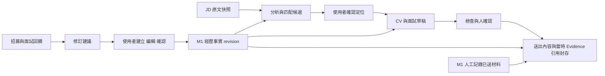

# Authority and Ownership Map

Scope：本案資料權威。Current：只有文件，無 runtime。五條產品 invariant 已於 R1 凍結；下圖是尚未實作的流程。

- Owner：人決定自己的事實與對外使用；應用程式是唯一寫入協調者；AI 提供候選。
- Source of truth：Evidence 保存確認的自述/支持來源；JD/Interaction 保存「來源說過什麼」；Submission 保存當時實際送出內容。
- Boundary / read-write：生成文句只能寫草稿，不能提升為 Evidence；回饋先進提案。M1 人工記錄歷史材料可直接保存，不要求 M2 檢查；缺少當時引用必須標未知。
- Invariants：引用固定 revision 並能還原內容；送出 content/submitted_at/opportunity/source/當時引用不隨新版更動；面試指向實際送出版本。來源明確不等於外部事實已證實；事後補充另記，不回填原快照。
- Open questions：具體儲存交易與 revision ID 形式待 T01/T02；Insufficient evidence。
- Validation evidence：對照附件 evidence-first、CV/Interview consistency 與本輪版本要求；未執行產品測試。
