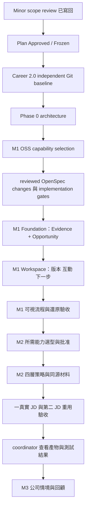

# Change Delivery Flow

Scope：本案由規劃到可驗收產品的交付。Current：2026-09-13，Plan Frozen R1、獨立 Git baseline、T02/T01 與 OpenSpec planning 已完成；產品實作未開始。現況權威見 [CURRENT_ARCHITECTURE.md](../CURRENT_ARCHITECTURE.md)。

- Owner：使用者批准產品及工具；coordinator 負責 scope、順序、衝突、最終驗證；任務完成回報不能代替驗收。
- Source of truth：本次 scope review、R1 frozen plan、後續選型證據與實際測試/產物。
- Boundary / read-write：本案 repo 與 M1 能力選型已完成；後續實作按 reviewed OpenSpec changes 執行。Engineering Memory 是 optional reference，沒有 runtime dependency；push、部署、發訊息不由本圖自動授權。
- Invariants：M1 Evidence 不延後到 M2；快照含當時證據；Interaction 不變 CRM；M1 不冒充完整 MVP；BLOCKED 不算 PASS；五條產品 invariant 優先於工具選擇。
- Open questions：投入工時、日程與 implementation gate 結果，Insufficient evidence。
- Validation evidence：實施計畫保留 16 個核心工作項目與 20 項驗收場景；T00/T02/T01 文件工作完成，產品驗收未執行，無 implementation pass。
