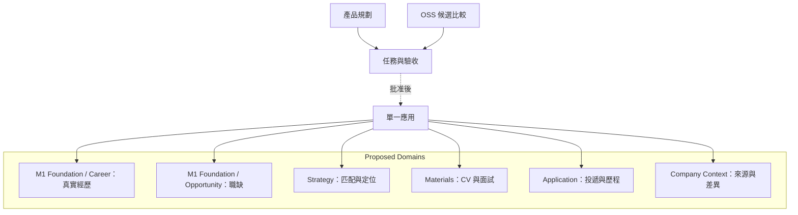

# Repository Responsibility Map

Scope：現有文件與未來產品責任。Current：Career 2.0 已有獨立 Git baseline，尚無產品程式。Proposed：單一應用，不是六個微服務。現況與 T01 選型以 [CURRENT_ARCHITECTURE.md](../CURRENT_ARCHITECTURE.md) 為準。

- Owner：coordinator 維護跨領域契約；各領域只承擔表列責任，不增加額外平台。
- Source of truth：PRODUCT_PLAN 的領域定義；程式 module paths 尚未決定。
- Boundary / read-write：Career 管事實修訂；Materials 管產物；Application 管送出與事件；其他域引用版本，不各自改寫同一事實。
- Invariants：Career Evidence 與 Opportunity 同屬 M1 foundation；Story 不複製事實權威；Application 不另建第二套 Opportunity；M1 Interaction 限九項紀錄，不建 CRM；Company Context 深化在 M3。
- Open questions：實際模組路徑與選定 runtime 的驗證仍待實作；不得從此圖推論檔案已存在。
- Validation evidence：領域責任已對照完整需求；無 code graph generation 可供程式結構驗證。
