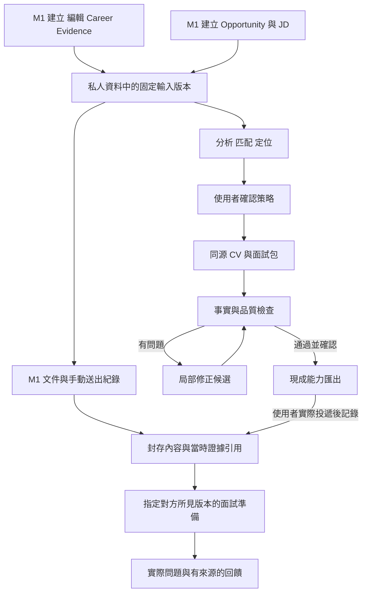

# Runtime and Data Flow Map

> STATUS: HISTORICAL_REFERENCE
>
> 本檔是 2026-09-13 的 Proposed data-flow snapshot。不要把它當成 current runtime 或 architecture authority；目前架構契約以 [CURRENT_ARCHITECTURE.md](../CURRENT_ARCHITECTURE.md) 為準，current behavior/validation 以 OpenSpec change artifacts 為準。未來 runtime 產生的 evidence 不回填本檔。

Scope：從 M1 foundation 到 M2 intelligence 的資料流。Current：沒有 runtime；產品規則已凍結，所有執行節點尚未實作。

- Owner：應用程式協調狀態與寫入；現成 AI/renderer 只處理被提供的任務輸入。
- Source of truth：私人資料中的 Evidence/JD/Positioning revisions；檢查結果綁定所檢 revision。
- Boundary / read-write：公開/私人輸入先保存來源，再分析；生成結果為候選；匯出不觸發已投事件，也不對外傳送。
- Invariants：M1 有無 AI 皆可用；送出五項欄位與引用 immutable；未知歷史引用不事後回填。M2 有限重試、可取消；舊回傳不蓋新輸入；修文後舊 pass 失效；重要 claim 可追來源。
- Open questions：執行方、處理限制、儲存與輸出介面待選型，Insufficient evidence。
- Validation evidence：T07/T04/T05/T06 涵蓋 M1 foundation、快照及面試版本基準；T08/T13/T14/T15 涵蓋 M2；全部產品驗收尚未執行。
