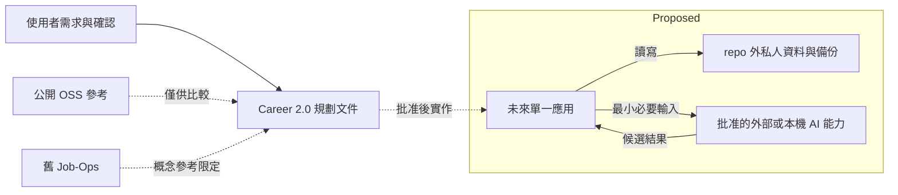

# Workspace Boundary Map

Scope：本案工作位置與外部邊界。Current：M1 Foundation runtime 與 repo/private-root boundary 已建立並通過 acceptance；`m1-opportunity-evidence-substrate` 的最小 domain records 由主程序寫入 synthetic private root，implementation、validation、read-only acceptance 與 archive 已完成。完整產品私人資料流程尚未建立。Proposed：完整產品私人資料及外部執行能力仍未建立。

- Owner：使用者擁有資料與產品決策；coordinator 整理規劃與驗證。
- Source of truth：本輪需求；未來私人事實由使用者確認的版本化紀錄承接。
- Boundary / read-write：目前只有最小 substrate domain operations 可經 main process 寫入 private root；renderer 不直接寫檔案或資料庫；AI 與 OSS 不直接寫入；本輪不讀舊案資料。
- Invariants：私人資料不進 repo；本案不繼承舊 repo；外部 AI 發送範圍需先批准。M1 已確立 private root，完整 workspace 與外部推論仍 deferred。
- Open questions：是否允許外部推論、所選執行能力及完整 workspace 邊界，Insufficient evidence；不影響目前最小 substrate。
- Validation evidence：Foundation 與最小 substrate 均使用 synthetic private root 並驗證 repo isolation、restart/read-back 與 boundary；完整產品-domain data/workflow 尚未執行。圖內產品 Proposed 邊界不等同於 Foundation 或 prerequisite 已完成 acceptance。
