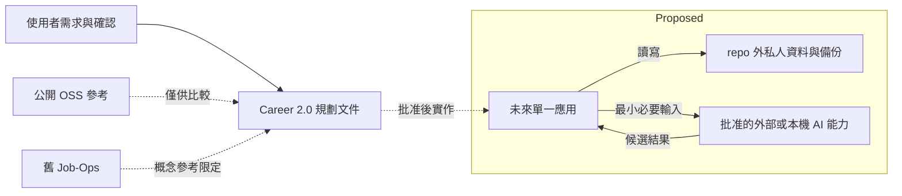

# Workspace Boundary Map

Scope：本案工作位置與外部邊界。Current：只有規劃文件。Proposed：私人資料及執行能力均未建立。

- Owner：使用者擁有資料與產品決策；coordinator 整理規劃與驗證。
- Source of truth：本輪需求；未來私人事實由使用者確認的版本化紀錄承接。
- Boundary / read-write：只有未來應用可寫私人主資料；AI 與 OSS 不直接寫入；本輪不讀舊案資料。
- Invariants：私人資料不進 repo；本案不繼承舊 repo；外部 AI 發送範圍需先批准。
- Open questions：私人根目錄、是否允許外部推論、所選執行能力，Insufficient evidence。
- Validation evidence：初始目錄為空；本輪只建立 Markdown；使用者確認單人自用。圖內 Proposed 尚無 runtime 證據。
