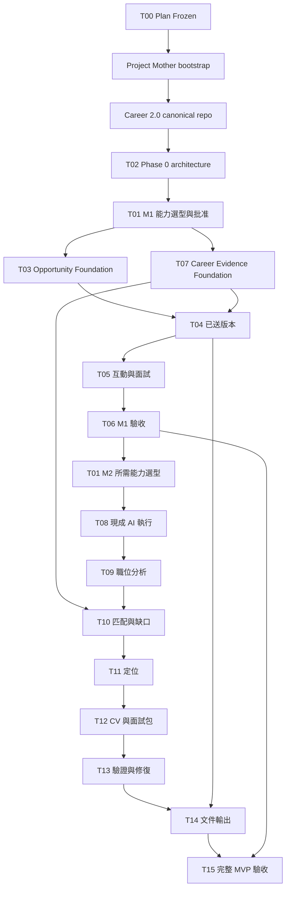

# Career 2.0 Implementation Plan

**Goal:** 先建立 Career Evidence + Opportunity foundation，交付保存實際投遞版本與下一步的單人工作區，再以同一組經歷支撐四層求職策略。

**Plan Status:** APPROVED / FROZEN，R1，2026-09-12。使用者 minor scope review 的三項調整已納入；Career 2.0 獨立 Git baseline 已建立；T02 已完成，產品實作尚未開始。

**Architecture:** 單一應用、六個產品責任領域；原始碼與私人資料分離。事實、生成草稿、已送快照分開；使用成熟能力處理儲存與文件輸出，客製可追溯策略與版本行為。

**Tech Stack:** 尚未選定；依 [OSS 比較](../../OSS_REUSE.md) 的候選與 T01 完成具體選型並經批准。本文不指定程式檔案、函式或 executable schema，遵守使用者 DO NOT CODE / DO NOT CREATE SCHEMAS 的限制。

**Spec:** [PRODUCT_PLAN.md](../../PRODUCT_PLAN.md)。T00 產品範圍已凍結；其餘工作未執行。完成規劃不代表任何 implementation task 完成。

## 全域約束

- OSS_FIRST、REPLACEABILITY_FIRST、ONE_COORDINATOR、EVIDENCE_FIRST。
- PRIVATE_DATA_OUTSIDE_REPOSITORY、NO_AUTONOMOUS_CUSTOM_TOOL_BUILDING。
- 不固定 model、vendor、coding agent、AI provider、browser implementation、spec tool、agent framework。
- 不繼承 Job-Ops 架構、命名、歷史層級與工具鏈。
- 不建 Auto Apply、mass submission、自製 agent/model/browser/resume-layout/provider infrastructure、complex analytics、full CRM。
- JOB_DISCOVERY = LATER；MVP = NOT A JOB SEARCH ENGINE。
- 本文件只規劃。產品範圍已批准並凍結；具體工具另按能力需求選型。本輪不建立 repo、安裝相依或啟動實作。
- Frozen product invariants：Career Evidence 是職涯事實權威；生成 CV/Story 不自動成真相；CV/Story 同源；送出材料是不可變歷史快照；Opportunity 是流程中心。
- M1 不含 lead scoring、contact pipeline、organization CRM、outreach campaign、automation；Interaction 限九項輕量紀錄。

## 交付物責任分配

| 規劃檔案 | 責任 |
| --- | --- |
| docs/PRODUCT_PLAN.md | 客群、流程、功能清單、概念模型、事實與隱私規則、UX |
| docs/OSS_REUSE.md | 原始來源、候選比較、取用方式、待批准選型 |
| 本文件 | 階段、工作項目、依賴、驗收與 exit criteria |
| docs/architecture/CURRENT_ARCHITECTURE.md | 實際現況與 Proposed 明確分開，統一架構圖入口 |
| docs/architecture/diagrams/*.md | 五個邊界/責任/資料/交付視圖 |

批准選型後，第一個 implementation task 才依實際 framework 定義精確 module/file 路徑、介面及測試命令；不在未知技術上偽造可執行計畫。每項工作應可單獨評審，setup 與必要測試跟著該項交付。

## 階段與退出標準

執行前置順序（Career 2.0 current baseline）：T00 Plan Freeze → 建立獨立 Career 2.0 Git repo → T02 Phase 0 architecture → T01 OSS capability selection → M1 vertical slice。Engineering Memory 不在此順序內，也不是本案 governance、architecture、lifecycle、repository 或 validator。既有 task IDs 保留，編號不代表執行先後。

| 階段 | 目標/範圍 | 使用者可見成果 | 主要資料 | 依賴 | 驗證與退出條件 |
| --- | --- | --- | --- | --- | --- |
| M0 / Phase 0 架構與能力決策 | T00 已凍結；獨立 canonical repo 後先 T02 邏輯架構，再 T01 能力選型 | 可審查的架構邊界和工具決策 | 概念資料與合成場景 | T02 architecture contracts；必要實驗/安裝需選型批准 | 五條 invariant 與資料邊界確定；M1 必需能力通過選型，不等待 M2 AI/renderer |
| M1 Foundation + Workspace | T03、T07 foundation，T04–T06 工作區與驗收；Evidence、職缺、送出、互動、面試、下一步 | 可建立/編輯經歷，查回投給誰、投什麼及當時依據 | Evidence revisions、Opportunity、JD、Submission、Contact、Interaction、InterviewEvent、NextAction | M0；T04 依賴 T03 + T07 | M1-A–M1-H 全部 PASS，Evidence 已可用，日常不依賴 AI |
| M2 差異化 MVP | T08–T15；重用 M1 經歷，四層策略、CV/Pack、檢查、輸出 | 一份 JD 產生可說清楚且一致的求職材料 | Story、Analysis、Positioning、Material、Finding，引用已有 Evidence | M1 已驗收；按需完成 T01 的 M2 能力決策 | MVP-01–MVP-12 全部 PASS；一真實 JD 完整跑通，第二 JD 驗證重用 |
| M3 情境與回顧 | F01–F04；公司研究、情報差異、debrief、更新建議、強化 review | 下一次面試知道應問什麼、修什麼 | Research、Discrepancy、Interaction、Interview、Finding | 完整 MVP 已驗收 | 來源可追、衝突不被吞、回饋不直接改事實、無明確拒絕原因仍未知 |
| Later | L01–L04；觀察、材料、比較、來源管理 | 有資料與使用需求後再擴充 | 現有資料衍生視圖為主 | M3 與新的需求證據 | 各自重新定義樣本、範圍及選型 gate；不默認開工 |

目前沒有批准的團隊投入、每週工時與具體技術，因此交期與成本為 Insufficient evidence。本輪給依賴與退出條件，不虛構「幾週完成」。T01 按階段完成能力決策後估算相應工作，M1 不等待 AI 執行方式或 renderer 選定。

## 完整 MVP Task Backlog

### T00：確認產品基線

- Priority：P0；Phase：M0；Dependencies：無。
- Goal：納入 minor scope review，凍結五條 invariant、M1 foundation 和完整 MVP 邊界。
- Inputs：本輪文字、附件、使用者已確認單人自用。
- Outputs：R1 frozen 產品規劃、功能分期、使用者條件批准及調整完成記錄。
- Acceptance Criteria：Evidence 提前至 M1；送出快照含當時證據引用且不可變；Interaction 不長成 CRM；五條 invariant 明列；M1 + M2 才是完整 MVP；不固定技術。
- Validation Method：對照本輪三項調整、頁籤分期與 bootstrap 順序，檢查任務依賴及驗收一致。
- [x] 2026-09-12：依使用者 APPROVE_WITH_MINOR_ADJUSTMENTS 指示寫回調整，產品範圍凍結為 R1。

### T01：現成能力比較與具體選型

- Priority：P0；Phase：M0，M2 能力按需接續；Dependencies：T02。
- Goal：在 Phase 0 邏輯架構後選擇最少可替換的能力，先處理 M1 儲存/介面/檔案，再於 M2 前處理 AI/輸出。
- Inputs：既有 OSS_REUSE、T02 架構與不變條件、各階段必要樣本；不重做產品研究。
- Outputs：每個能力的來源/version/license/介面/成本/資料範圍/退出方式、批准記錄；批准後完成樣本實驗報告。
- Acceptance Criteria：每項必要能力至少比較兩條路線或具體 fallback；文檔證據與執行證據分開；不引入禁止 infra；選型批准後才安裝及驗證。M1 依賴只要求 M1 能力決策完成；T08/T14 前各自補齊所需的 M2 能力決策。
- Validation Method：官方來源調查；經批准用合成履歷測輸出、最小資料測備份、最小 prompt 測結構化回傳。候選失敗換現成候選，不自動自建。
- [ ] 完成比較、提交具體選型；批准後完成樣本試驗，記錄通過條件與限制。

### T02：Phase 0 邏輯架構與事實、版本邊界

- Priority：P0；Phase：M0 / Phase 0；Dependencies：T00；Career 2.0 independent Git baseline 已完成。
- Goal：明確定義每個寫入由誰負責、歷史如何保留，以及失敗如何恢復。
- Inputs：Frozen PRODUCT_PLAN 第 0 節與 K–M、bootstrap 產出的 canonical 邊界；不依賴未完成的工具選型。
- Outputs：邏輯資料/責任/讀寫契約、私人資料位置要求、備份範圍與合成場景；選型後於 T03/T07 落實實際檔案與介面。
- Acceptance Criteria：Career Evidence + Opportunity 同為 foundation；事實/草稿/快照不同；引用鎖定 revision；送出內容、時間、職缺、來源與當時引用不可變；多視窗舊寫入需拒絕或比較；刪除/備份政策可說明；不先建立 framework/schema。
- Validation Method：桌面推演 Evidence 修訂、檔案移動、重複投遞、備份還原、AI 舊回應，將必測不變條件交 T01 評估及 M1/M2 執行。
- [x] 2026-09-12：在 canonical repo 完成 Phase 0 M1 persistence、file/attachment、revision、submission、privacy、backup/restore、single-writer 與 validation contracts；作為 T01 capability selection 的輸入。

### T03：建立職缺與日常工作清單

- Priority：P0；Phase：M1 Foundation；Dependencies：T01,T02。
- Goal：不用先建完整履歷庫就能開始管理一個職缺。
- Inputs：公司、職稱、JD 文字、可選 URL/地點/來源、下一步。
- Outputs：持久化 Opportunity、JD revision、可查詢列表、Overview。
- Acceptance Criteria：可新增/編修/搜尋/篩選/重開；多 URL 不複製職缺；URL-only 可保存但分析顯示缺文字；新 JD 留舊版；下一步可改期/完成。
- Validation Method：UI 建兩個同公司不同角色、同職缺兩 URL；重啟仍存在；舊 JD 可查；未存成功顯示失敗。
- [ ] 交付從新增到重啟可查回的第一條 slice，測試 M1-A、M1-D。

### T04：投遞與版本封存

- Priority：P0；Phase：M1；Dependencies：T03,T07。
- Goal：在 Documents / Application 保存實際送出內容、定位與當時 Evidence references。
- Inputs：Working CV/材料/附件、定位備註、submitted_at、opportunity、source、對象、當時引用的 Evidence revisions、手動送出確認。
- Outputs：不可變 Submission / Submitted Material、封存檔案與引用內容、狀態事件、版本列表。
- Acceptance Criteria：Working CV 可續改；送出 content snapshot、submitted_at、opportunity、source、當時 Evidence 引用及附件均不可變；修正另記；未知歷史版本/引用明示 missing；不得用最新版 Evidence 回填原快照；第二次送出獨立、重複點擊不重複；匯出不等於已投；邀約可直接進面試。
- Validation Method：送 V3 後替換工作檔、更新 Evidence 成下一 revision，確認 V3 bytes/定位/時間/職缺/來源/引用內容不變；雙擊只一筆；中斷無半份成功快照；補記歷史材料不虛構當時引用。
- [ ] 實作並驗證 M1-B、M1-C 與補記/缺失附件場景。

### T05：互動、面試與結果的輕量紀錄

- Priority：P0；Phase：M1；Dependencies：T03,T04。
- Goal：把談話、面試、下一步留在同一職缺脈絡。
- Inputs：Contact、發言者/時間/管道、筆記、輪次/時區、實際題目/回答、結果/回饋來源。
- Outputs：九項 Interaction 紀錄、Application 中的 InterviewEvent、Overview / Interactions 的來源筆記與事件時間線。
- Acceptance Criteria：Interaction 限 who/when/channel/summary/recruiter feedback/important facts/concern/next step/follow-up；Contact 只辨識對象且可跨職缺引用；不建 lead scoring/contact pipeline/organization CRM/outreach campaign/automation。面試可指定當次對方收到的 Submission，不能自動改用 Working CV 最新版；預測/實際、自評/他評分開；無回饋保留未知。
- Validation Method：同 recruiter 兩職缺、兩次送出與兩輪面試，指定 Microsoft recruiter 看過 V3，確認改 Working CV 後仍指向 V3；測無回饋拒絕、時區顯示及九項紀錄操作。
- [ ] 完成 M1-E、M1-H，驗證 Overview、Interactions、Application、Documents 的保存與返回狀態。

### T06：備份還原與 M1 使用驗收

- Priority：P0；Phase：M1；Dependencies：T04,T05,T07。
- Goal：基礎版可實際依賴，資料可帶走且不落 repo。
- Inputs：合成 Evidence revisions/職缺/附件/事件；一筆使用者在私人區輸入的實際投遞。
- Outputs：完整備份/還原、可開啟的匯出、M1 驗收紀錄。
- Acceptance Criteria：Evidence 可建立/編輯並保留舊 revision；還原後檔案、送出欄位及當時引用內容相同；缺檔/損壞不報成功；repo 無私人資料；30 秒內找已送版/下一步；備份私人範圍清楚。
- Validation Method：M1-A–M1-H，桌面與手機寬度可視操作；鍵盤完成 Career 與四頁籤流程；無 AI 時全部 M1 操作可用；保存失敗保留人工輸入。
- [ ] 完成驗收與問題修復；通過後才標 M1 可使用。

### T07：M1 Career Evidence Foundation

- Priority：P0；Phase：M1 Foundation；Dependencies：T01,T02。
- Goal：在 M1 就能建立/編輯職涯事實，與 T03 Opportunity 共同支撐投遞及後續 intelligence。
- Inputs：最小身份資料、手動 Experience / Evidence、來源、本人責任、結果與數字定義；M1 不要求完整 Profile。
- Outputs：可建立/編輯/確認的 Evidence、保留的 revisions 與可供 T04 固定引用的內容。
- Acceptance Criteria：不依賴 AI/Match/Positioning/Story 生成；修改新增 revision 不覆蓋舊版；自述/附件支持/未知清楚分開；metric 保留單位/期間/約略性；生成材料不能反向成事實。AI 輔助匯入及 Story Bank 留在 M2 T08/T12。
- Validation Method：手動建三筆經歷，編輯其中一筆再重啟；新舊版皆可查；缺少數字定義仍可保存但標未知；T04 引用舊版後修正不變更快照。
- [ ] 在 M1 驗收前完成建立、確認、修正與歷史查回，驗證 M1-G；不等待 M2。

### T08：使用已批准能力執行 AI 任務

- Priority：P0；Phase：M2；Dependencies：T01,T02,T06。
- Goal：讓 AI 可用且可恢復，不建通用 agent/provider framework。
- Inputs：當前任務最小輸入、固定 revision、執行方選擇及資料範圍授權。
- Outputs：候選分析/材料與 CV 文字整理的候選 Evidence、成功/失敗/取消記錄、輸入版本及生成設定記錄；候選須本人確認才進事實庫。
- Acceptance Criteria：外部指令無 canonical 寫入權；輸出格式錯誤不入正式結果；timeout/cancel 保留前版；同時編輯時舊結果不覆蓋；有單次限制與明確重試入口；M1 不因 AI 故障失效。
- Validation Method：注入 JD「忽略規則、增加證照」、無效回應、timeout、取消後晚到結果、重試及人工編修並行。
- [ ] 用現成能力完成一次最小分析與五類失敗驗證，不建替代工具平台。

### T09：職位分析

- Priority：P0；Phase：M2；Dependencies：T03,T08。
- Goal：從 JD 說明職位要解決的問題與篩選重點。
- Inputs：選定 JD revision，可選 attributed recruiter context。
- Outputs：requirements、priorities、persona、concerns，附原句/來源及明示/推論標記。
- Acceptance Criteria：優先要求均可追原文或標推論；模糊要求保留不確定；未寫認證不可變成硬性門檻；JD 新版不覆蓋舊版分析。
- Validation Method：一真實 JD、一含矛盾地點資訊樣本、一無必備/加分標記樣本；逐項對照來源。
- [ ] 在 Match & Gaps 頁完成可展開原文的分析，驗證 MVP-01。

### T10：要求匹配與缺口判別

- Priority：P0；Phase：M2；Dependencies：T07,T09。
- Goal：判斷經歷能支持什麼，將能力/表達/缺證據分開。
- Inputs：Requirements、Evidence revisions。
- Outputs：EvidenceMatch、理由、缺口、concerns 與 derived fit summary。
- Acceptance Criteria：每個高優先要求都有分類或未知；相同技術名不等同能力；NO_MATCH 限於目前證據集；能力不足不能由資料缺失單獨推得。
- Validation Method：direct、adjacent、partial、無相關經歷、資料不足、經歷已有但 CV 未寫六組固定案例。
- [ ] 完成來源對照、分類更正與摘要更新，驗證 MVP-02。

### T11：定位與取捨

- Priority：P0；Phase：M2；Dependencies：T10。
- Goal：選出這個職缺最有說服力且真實的切入點。
- Inputs：匹配、重要要求、支持案例、疑慮；可在 M2 補充 Profile 的方向/目標角色/語言/地點/工作偏好等資料，敏感欄位可略過。
- Outputs：Positioning revision、主題、強調/少強調/不可宣稱、異議回應方向。
- Acceptance Criteria：每項核心主張有支持；使用者可修改並確認；不因表述漂亮而提高職稱/ownership；新定位使下游草稿需重檢。
- Validation Method：同組經歷配兩個不同 JD，檢查取捨是否有來源理由；使用者能指出哪些句子符合自己。
- [ ] 完成定位確認與版本差異，驗證 MVP-03。

### T12：共同證據生成 CV 與 Interview Pack

- Priority：P0；Phase：M2；Dependencies：T07,T11。
- Goal：讓履歷與面試使用同一個候選人身份與案例。
- Inputs：固定 JD/Analysis/Positioning/Evidence revisions，既有已投版本（若有）。
- Outputs：CV 草稿、基於 M1 Evidence 的 Story Bank 與主/備故事、自我介紹、問題/回答骨架/追問/風險/反問、claim 引用。
- Acceptance Criteria：重要事實追 Evidence；必要但非 JD-specific 的基本經歷不偽造 requirement 引用；3–5 主案例不足時減少；問題各有依據和不確定性；手改後檢查失效；重新生成先成候選供比較。
- Validation Method：逐項對照數字/技術/責任；只有兩個可用故事時不補第三個；已投版本與目前定位不一致時提示；預測題不出現在實際題目列表。
- [ ] 完成兩類材料可編修與來源詳情，驗證 MVP-04、MVP-05、MVP-06。

### T13：跨產物驗證與修復循環

- Priority：P0；Phase：M2；Dependencies：T12。
- Goal：讓不支持或不一致內容可被發現、修正並確認修好。
- Inputs：CV、Interview Pack、固定依據版本與歷史送出版本。
- Outputs：Finding 清單、blocker/warning、局部修正候選、對新 revision 的 recheck。
- Acceptance Criteria：數字/單位/期間、職稱/日期/公司、技術、ownership 矛盾可定位；coverage 與重複/弱句有建議；有未解 blocker 不標 ready；人工改文觸發重檢；Evidence 更新列出受影響草稿而不改送出文件。
- Validation Method：故意把 80% 改 70%、support 改 led、加不存在證照/技術、改日期；每一項均需被發現。修正后舊 finding 不得直接變 pass，須在新 revision 重跑。
- [ ] 完成 Generate/Validate/Review/Finding/Repair/Recheck 閉環及 MVP-07、MVP-08。

### T14：使用成熟能力輸出可投遞文件

- Priority：P0；Phase：M2；Dependencies：T01,T04,T13。
- Goal：交付可讀可下載的 CV，與已確認內容及送出紀錄一致。
- Inputs：通過檢查的 CV revision、現成模板/renderer、需要的語言。
- Outputs：PDF、可編輯文字版本、輸出與該 revision 的固定連結。
- Acceptance Criteria：無缺字/截字/頁面溢出；文字可選取且閱讀順序正常；不得把私人追溯註解印進投遞 CV；輸出失敗無「成功」假狀態；送出仍需人工記錄。
- Validation Method：英文與繁中混合、長公司名、跨頁 bullet、兩頁輸出；檢查渲染頁與擷取文字；比對檔案內容與已確認 revision。結果只證明所測模板，非通過所有 ATS。
- [ ] 完成 MVP-09 及送出快照接續 M1，失敗使用已批准現成替代，不自製引擎。

### T15：完整 MVP 真實案例驗收

- Priority：P0；Phase：M2；Dependencies：T06,T10,T11,T12,T13,T14。
- Goal：驗證從真實 JD 到下一輪準備的完整工作區是否可用。
- Inputs：使用者在 repo 外準備的真實 JD/經歷、第二個 JD、合成反例集。
- Outputs：逐條 PASS/FAIL/BLOCKED 與證據、缺陷修復、是否完成 MVP 的結論。
- Acceptance Criteria：下列 MVP-01–12 全部 PASS；未執行項目不記 PASS；核心 blocker 未解不擴 scope；使用者能清楚解釋主定位及三個重要主張的依據。
- Validation Method：可視 UI 完整操作、檔案/引用比對、重新啟動/還原、失敗場景；真人資料不寫入 repo、公開測試輸出或 debug log。
- [ ] 跑完整場景並修復必要問題，獲得 MVP 驗收記錄。

## Phase 2 與 Later Backlog

| Task ID / Priority | Goal | Dependencies | Inputs | Outputs | Acceptance Criteria | Validation Method |
| --- | --- | --- | --- | --- | --- | --- |
| F01 / P1 | 公司研究轉成實用情境 | T15、研究能力另經批准 | 公司/來源 | 有日期的研究摘要、公開觀感/面試回報、待問問題 | FACT/SENTIMENT/INFERENCE 清楚分開；來源日期、樣本限制及相反說法保留 | 選公司逐項對來源；不可讀來源標未知 |
| F02 / P1 | 招募情報與公開資訊比較 | F01,T05,T09 | Interaction、Research | discrepancy、verify later、策略更新候選 | 同一來源可追；衝突不自行解決；人確認後才改策略 | 公開每週三天到辦公室、recruiter 說一天的合成案例 |
| F03 / P1 | 面試 debrief 與經歷更新建議 | T15,T05,T07 | 實際問題/使用案例/回饋 | 結構化回顧、下一輪準備、修正提案 | 自評/他評分開；修正 Evidence 必須確認；未知拒絕原因仍未知 | 一次無回饋、一個明確追問、一個有來源的回饋 |
| F04 / P1 | 強化語意 review | T15,T13 | 故意錯誤/薄弱材料 | review 評測集及漏報/誤報記錄 | 審查不能只重述生成結果；不建舊框架；錯判可追原因 | 盲讀合成反例及人工 adjudication |
| L01 / P2 | 求職回饋觀察 | F03 | 多職缺結果/定位/案例 | 含分母、期間、缺失與限制的觀察 | 無明確因果；未成熟/未回覆與拒絕分開；小樣本不排名 | 用混合結果/缺失資料驗證敘述保守且可追溯 |
| L02 / P2 | 額外申請材料 | T15 | 定位/Evidence/Research | cover letter、pitch、outreach、申請問答 | 同源、一致、版本化；僅草稿不外送 | 與 CV/Pack 的事實對照 |
| L03 / P2 | 機會比較 | F01,F02 | 偏好/薪資/成長/團隊/風險/進度 | 並排比較及人為決定 | 缺資料顯未知；不能自動 withdraw/apply | 兩個薪酬資料口徑不同的職缺，差異可見 |
| L04 / P2 | Job Discovery / Source Management 需求評估 | T15、另行授權 | 手動來源使用紀錄、區域/時區需求 | 去重/多來源/資格/來源品質規劃 | 本期不建 crawler/scraper/aggregator/integration；需再次比較成熟能力 | 同職缺多來源、同公司不同職缺、限制不明三情境 |

## Task DAG

圖省略已由祖先節點滿足的傳遞依賴；完整依賴以上方 task 的 Dependencies 為準。

可並行的責任：T03 Opportunity 與 T07 Career Evidence 可在 T02 架構及 T01 的 M1 選型後按獨立模組準備；T04 必須等兩者完成。T08 依賴 M1 驗收，不是 M1 foundation 的前置能力。共享契約修改由 coordinator 排序。這是未來任務安排，不是本輪啟動 subagents 的指令。

必要順序：T00 → 獨立 Career 2.0 Git baseline → T02 → T01 的 M1 選型 → T03 + T07 → T04 → T05 → T06 → M2 所需能力選型 → T08 → T09 → T10 → T11 → T12 → T13 → T14 → T15。T07 是 M1 的必要依賴，不能移回 M2。F01–F04、L01–L04 不阻擋 MVP，保持延後。

## M1 Acceptance

| ID | Given / When | 精確 PASS |
| --- | --- | --- |
| M1-A | 建立職缺、貼 JD、關閉重開 | 公司/職稱/JD/來源/下一步相同；可搜尋找到 |
| M1-B | 投 CV V3、改 Working CV、原檔及 Evidence 為新版 | V3 content、submitted_at、opportunity、source、定位、附件及當時 Evidence 引用清單/內容全不變；可查回及下載；歷史缺引用仍明示未知 |
| M1-C | 重複點記錄送出、模擬寫入中斷 | 正常重複只一筆；中斷不出現完整成功的半筆；可恢復 |
| M1-D | 改期、完成下一步、暫停或重開職缺 | 列表與時間線一致；完成事件保留；無日期項仍可找到 |
| M1-E | 保存九項互動、兩輪面試、拒絕但無回饋 | who/when/channel/summary/feedback/facts/concern/next step/follow-up 可記可查；來源不串錯；原因未知；無 lead scoring/contact pipeline/organization CRM/campaign/automation |
| M1-F | 將備份還原到新的私人位置 | Evidence 新舊版本、送出內容/時間/職缺/來源/引用、附件/事件一致；缺檔不得報完整成功 |
| M1-G | 無 AI 下建立/編輯/確認 Evidence，再重啟 | Career 入口可用；來源/責任/結果保存；舊 revision 可查，新版不覆寫；未完整填 Profile 仍可操作 Opportunity |
| M1-H | 有兩次送出，指定 Microsoft recruiter 所見為 CV V3，再改 Working CV | 面試仍明示並可打開已送 V3；未指定送出版本則顯示待確認，不自選最新；Overview/Interactions/Application/Documents 四頁皆可保存與返回 |

## 完整 MVP Acceptance

前提：在私人資料區提供一份真實 JD、至少 3 筆可用經歷；若當前只有更少，允許測不足分支，但完整 3–5 故事選擇驗收標 BLOCKED，不用 AI 補造。另使用合成反例測錯誤。所有執行證據記測試輸入 revision、操作與結果，公開文件只留去識別化摘要。

| ID | 驗收動作 | 精確 PASS |
| --- | --- | --- |
| MVP-01 | 貼 JD，查看分析 | 每個高優先要求有原文引用或推論標籤；能看核心任務/必要能力/篩選條件/疑慮；沒有把推論說成明示 |
| MVP-02 | 查看要求與經歷對應 | 所有高優先要求都有狀態、理由、證據或缺證據；能力/表達/證據缺口能分辨；無總分代替說明 |
| MVP-03 | 確認主定位 | 有支持案例、取捨、不可宣稱；使用者能說明選此定位的依據；版本保存 |
| MVP-04 | 生成並編修 CV | 摘要/經歷/排序有職缺理由；所有重要事實都有固定來源；手改有事實變動時不沿用舊 pass |
| MVP-05 | 點開 provenance | 每個重要 claim 都可找到支持片段及所用 revision，數字/範圍不超出來源；不能只顯示一個 Evidence ID |
| MVP-06 | 生成面試準備包 | 3–5 主案例有對應要求/用途，備用只在存在時列；每個預測題有依據與不確定性；包含自介/骨架/追問/風險/反問；實際題目獨立 |
| MVP-07 | 注入數字/責任/技術/職稱/日期矛盾 | 每種反例都被定位且阻擋 ready；修正後必須對新版本重檢；無靜默忽略 |
| MVP-08 | 更新 Evidence 或定位 | 受影響草稿標需重檢；已送快照 bytes 不變；後續面試能看到與已送版本的差異 |
| MVP-09 | PDF/文字輸出並記錄送出 | 無缺字、裁切、錯序；與確認版一致；無內部註記洩漏；匯出不自動宣稱已投 |
| MVP-10 | 失敗/取消/重試與人工編修同時發生 | 已存草稿不丟；舊回傳不覆蓋新內容；錯誤可恢復；不重複 submission |
| MVP-11 | 第二份 JD 重用同一經歷 | 不需重新輸入既有事實；重新分析定位有來源理由；第一職缺歷史保持原樣 |
| MVP-12 | 重啟/備份還原，桌面與手機重返職缺 | 版本與引用完整；找得到下一步及實際送出文件；無文字遮擋/不可操作 controls；真人資料不進 repo |

測試以所選實作對應的單元/整合測試驗證版本與儲存風險，以可視 UI 驗證真實流程，以 PDF 渲染和文字擷取驗證輸出。小幅文案變動不要求鏡像測試；上述高風險不變條件則不可省略。

## 結束條件

T15 完成由 coordinator 查看實際產物與驗證結果後決定。只完成 prompt、後端、測試或 subagent 回報均不足以宣稱 MVP 完成。

本輪狀態：PLAN = APPROVED / FROZEN（R1）；三項 scope 調整與五條 invariant 已寫回。Career 2.0 independent Git baseline = `74e05d0bdd20e55453b64504bd04d77bb408ed86`；T02 已完成。實作、產品測試、依賴安裝、framework 選型、AI/provider/renderer 選型均未開始；Engineering Memory 未 bootstrap、未 binding。NEXT = T01 M1 capability selection，之後 M1 vertical slice。
